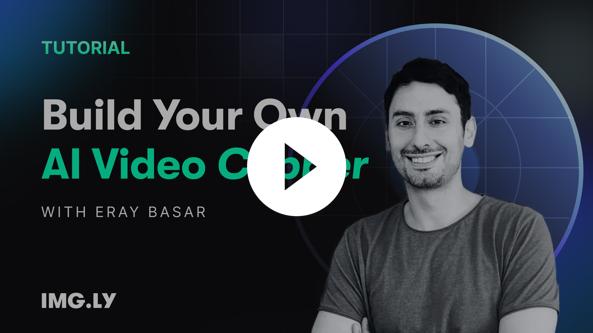

# Video Clipper — AI-Powered Short-Form Video from Long-Form Content

Drop a podcast, interview, or presentation into the browser and get back 3-4 ready-to-post short clips with captions, speaker tracking, and smart cropping. No server-side rendering, everything runs client-side via WebAssembly.

**Watch the 4-minute walkthrough:** | [Read the tutorial](https://img.ly/blog/build-in-a-day-ai-video-clipping-with-ce-sdk/)

[](https://www.youtube.com/watch?v=K4I9quiJ3Gc)

> **Note:** This codebase was almost entirely generated by AI ([Claude Code](https://claude.ai)). That's the point — we wanted to show how quickly you can build a sophisticated, functional app by combining AI-assisted coding with specialized SDKs and APIs. The entire project went from zero to working prototype in a single day.

## How It Works

1. **Upload** a video file (drag & drop into the browser)
2. **Transcribe** — audio is extracted client-side and sent to ElevenLabs Scribe or OpenAI Whisper for word-level timestamps + speaker diarization
3. **Analyze** — the full transcript goes to Gemini, which identifies the best 30-60 second segments (strong hooks, complete thoughts, standalone value)
4. **Map back to timestamps** — Gemini returns text, not timestamps. We match its selections against the word-level transcript to get frame-accurate cut points. This is more reliable than asking the LLM to output timestamps directly.
5. **Preview & adjust** — CE.SDK renders the trimmed clips in-browser with real-time playback, captions, and speaker-aware cropping
6. **Export** — download final clips directly from the browser

### Speaker Detection & Face Tracking

For multi-speaker videos, the app detects and clusters faces using face-api.js (TensorFlow.js, runs in-browser). Users confirm speaker-to-face mapping, then the system dynamically crops to follow the active speaker based on transcript diarization. Layout options include solo speaker, picture-in-picture, and side-by-side.

### Why Client-Side?

CE.SDK's CreativeEngine runs in the browser via WebAssembly. Video decoding, timeline manipulation, effects, and preview all happen on the user's device — no upload/download wait, no server costs that scale with video length, and non-destructive editing (switch aspect ratio or template without re-processing).

## Quick Start

```bash
git clone https://github.com/niclas-pfeifer/video-clipper.git
cd video-clipper
npm install
```

Create `.env.local` with your API keys:

```bash
# Transcription (pick one or both)
ELEVENLABS_API_KEY=sk_live_...
OPENAI_API_KEY=sk-...                  # optional, enables Whisper/GPT-4o-transcribe

# AI analysis
GEMINI_API_KEY=AIza...                 # Google Gemini (direct)
# — or —
OPENROUTER_API_KEY=sk-or-...           # via OpenRouter
NEXT_PUBLIC_GEMINI_PROVIDER=openrouter
NEXT_PUBLIC_GEMINI_MODEL=google/gemini-2.0-flash-exp
```

```bash
npm run dev
# → http://localhost:3000
```

See [Environment Variables](#environment-variables) below for the full list of configuration options.

## Tech Stack

| Layer | Technology |
|-------|-----------|
| Frontend | Next.js 15, React 18, TypeScript, Tailwind CSS |
| Video Engine | [CE.SDK](https://img.ly/creative-sdk) (CreativeEngine, WebAssembly) |
| Face Detection | face-api.js + TensorFlow.js (in-browser) |
| Transcription | ElevenLabs Scribe v2 / OpenAI Whisper / GPT-4o-transcribe |
| AI Analysis | Google Gemini (direct or via OpenRouter) |

## Architecture

```
Video File
  │
  ├─► CE.SDK loads video, extracts audio (MP3)
  │
  ├─► Audio → ElevenLabs/OpenAI → word-level transcript + speaker IDs
  │
  ├─► Transcript → Gemini → suggested clips (text selections)
  │
  ├─► Text matching → frame-accurate time ranges
  │
  ├─► face-api.js → face detection + clustering → user confirms speakers
  │
  └─► CE.SDK applies trims, captions, speaker templates → preview → export
```

### Key Design Decisions

- **Text matching over timestamp generation**: LLMs are bad at outputting precise timestamps. Instead, Gemini returns the transcript text to keep, and we match it back to the word-level timestamps from transcription. This is more reliable.
- **Semi-automatic speaker mapping**: Fully automatic speaker-to-face matching fails often enough to be annoying. A quick user confirmation step (a few seconds) prevents bad crops across the entire video.
- **Non-destructive editing**: All edits are metadata on top of the original video. Switch between 9:16, 16:9, and 1:1 or change speaker templates without re-processing.

## Environment Variables

Create a `.env.local` file. At minimum, you need one transcription provider and one AI analysis provider.

### Required

```bash
# Transcription — at least one:
ELEVENLABS_API_KEY=sk_live_...
# and/or
OPENAI_API_KEY=sk-...

# AI analysis — at least one:
GEMINI_API_KEY=AIza...
# and/or
OPENROUTER_API_KEY=sk-or-...
```

### Optional

```bash
# Transcription model overrides
NEXT_PUBLIC_ELEVENLABS_TRANSCRIPTION_MODEL=scribe_v1   # default: scribe_v1
NEXT_PUBLIC_OPENAI_TRANSCRIPTION_MODEL=whisper-1        # default: whisper-1

# Gemini configuration
NEXT_PUBLIC_GEMINI_PROVIDER=google         # google | openrouter (default: google)
NEXT_PUBLIC_GEMINI_MODEL=models/gemini-2.5-flash-lite
GEMINI_API_VERSION=v1                      # v1 | v1beta
NEXT_PUBLIC_GEMINI_PROXY_URL=https://...   # remote Gemini proxy

# OpenRouter configuration
OPENROUTER_SITE_URL=https://your-app.example.com
OPENROUTER_APP_TITLE=Video Clipper
OPENROUTER_BASE_URL=https://openrouter.ai/api/v1
```

Restart the dev server after changing environment variables.

## Scripts

```bash
npm run dev      # development server
npm run build    # production build
npm run start    # serve production build
npm run lint     # ESLint
npm run format   # Prettier
npm test         # Vitest
```

## License

Made by [IMG.LY](https://img.ly) with [CE.SDK](https://img.ly/creative-sdk).
